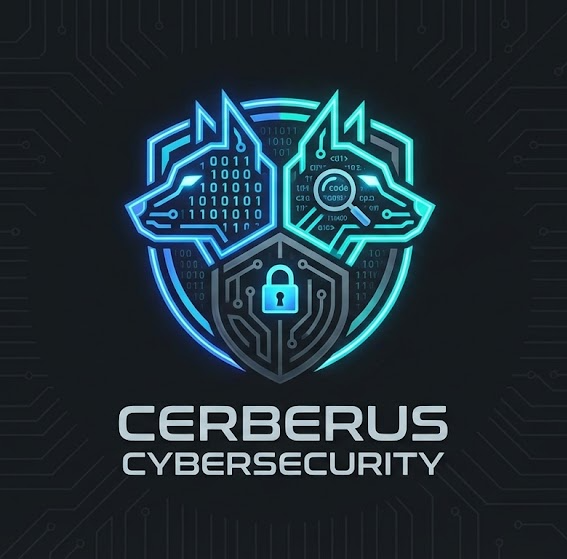

<div align="center">
  
</div>

# 🛡️ Laria Security Scanner

**Comprehensive security scanning for Java projects with defense-in-depth approach**

[](https://opensource.org/licenses/MIT)
[](https://www.docker.com/)
[](https://github.com/manojisnow/laria)

## Overview

Laria is a Docker-based security scanner that provides comprehensive security analysis for Java projects and containerized applications. It integrates 10+ industry-standard security tools to detect vulnerabilities across multiple layers:

- **Secrets Detection** - Find hardcoded credentials and API keys
- **SAST** - Static application security testing
- **Dependency Scanning** - Identify vulnerable dependencies
- **IaC Security** - Scan infrastructure-as-code files
- **Container Scanning** - Analyze Docker images for vulnerabilities
- **Helm Chart Security** - Scan Kubernetes Helm charts
- **Dockerfile Linting** - Best practices for container images
- **Dependency Consistency** - Detect version conflicts and diamond dependencies

## Features

✅ **10+ Security Tools** - Gitleaks, Semgrep, SpotBugs, Trivy, Checkov, Hadolint, Grype, Kubescape, Kubeaudit, Helm, Syft  
✅ **Multi-Layer Scanning** - Secrets, SAST, Dependencies, IaC, Containers, Helm Charts, Linting  
✅ **Container Image Scanning** - Trivy & Grype for built Docker images  
✅ **Helm Chart Security** - Kubescape, Kubeaudit, Helm lint, and Trivy for Kubernetes deployments  
✅ **Dependency Consistency** - Detects diamond dependencies and version conflicts via SBOM analysis  
✅ **SBOM Generation** - Software Bill of Materials via Syft for supply chain visibility  
✅ **Beautiful Reports** - HTML, Markdown, and JSON formats with remediation guidance  
✅ **Fast Scans** - ~2.5 minutes for comprehensive analysis with parallel execution  
✅ **CI/CD Ready** - GitHub Actions workflow included  
✅ **Docker-based** - No local tool installation required  
✅ **Remote Repository Support** - Scan directly from GitHub/GitLab URLs  
✅ **Smart Builds** - Auto-builds Maven/Gradle projects & Dockerfiles for deeper analysis  
✅ **Formatted Output** - Clean tables instead of raw JSON  
✅ **Configurable Severity** - Customizable thresholds and fail-on-severity levels  
✅ **Executive Summary** - High-level overview for stakeholders  

## Installation

### Option 1: Docker (Recommended)
No installation required! Just pull and run the container:
```bash
docker pull dumanoj/laria:latest
docker run --rm -v $(pwd):/repo dumanoj/laria:latest /repo
```

### Option 2: Standalone Installation
Install Laria and all tools directly on your system (Linux/macOS):

```bash
curl -sfL https://raw.githubusercontent.com/manojisnow/laria/main/install.sh | bash
```

This will install everything to `~/.laria` (isolated from your system):
- Tools in `~/.laria/bin`
- Python venv in `~/.laria/venv`

**Usage:**
Add the bin directory to your PATH:
```bash
export PATH="$HOME/.laria/bin:$PATH"
```

Then run:
```bash
laria /path/to/repo
```

### Uninstallation
To remove Laria cleanly:

```bash
curl -sfL https://raw.githubusercontent.com/manojisnow/laria/main/uninstall.sh | bash
```

This simply removes the `~/.laria` directory. No other files are touched.

## Quick Start

### 1. Pull or Build the Docker Image

**Option A: Pull from Docker Hub (Recommended)**
```bash
docker pull dumanoj/laria:latest
```

**Option B: Build from source**
```bash
git clone https://github.com/manojisnow/laria.git
cd laria
docker build -t laria:latest .
```

### 2. Scan a Repository

```bash
# Using the scan script (easiest)
./scan-repo.sh /path/to/your/repository

# Or use Docker directly
# If you pulled from Docker Hub, use: dumanoj/laria:latest
# If you built locally, use: laria:latest
docker run --rm \
  --tmpfs /tmp:rw,exec,size=4g \
  -v /path/to/repo:/path/to/repo \
  -v $(pwd)/reports:/laria/reports \
  dumanoj/laria:latest /path/to/repo
```

### 3. View Reports

```bash
# Open HTML report
open reports/laria_report_*.html

# Or view Markdown report
cat reports/laria_report_*.md
```

## Integrated Tools

| Tool | Purpose | What it Finds |
|------|---------|---------------|
| **Gitleaks** | Secrets Detection | API keys, passwords, tokens |
| **Semgrep** | SAST | SQL injection, XSS, code vulnerabilities |
| **SpotBugs** | SAST (Java) | Null pointers, resource leaks, security bugs |
| **Trivy** | Dependencies + IaC + Containers | CVEs, vulnerable packages, misconfigurations |
| **Grype** | Container Scanning | Container image vulnerabilities |
| **Checkov** | IaC Security | Dockerfile, K8s, Terraform issues |
| **Hadolint** | Dockerfile Linting | Best practices, security issues |
| **Kubescape** | Kubernetes Security | K8s misconfigurations, compliance checks |
| **Kubeaudit** | Kubernetes Auditing | Security policy violations |
| **Helm** | Helm Chart Linting | Chart validation and best practices |
| **Syft** | SBOM Generation | Software Bill of Materials, dependency analysis |

## Report Formats

Laria generates three report formats:

### HTML Report
- Beautiful formatted tables
- Color-coded severity levels
- Clickable CVE links
- Executive summary

### Markdown Report
- GitHub-compatible
- Clean tables for all findings
- Easy to read and share

### JSON Report
- Machine-readable
- Complete data for CI/CD integration
- Programmatic analysis

## Example Output

```
🛡️ Laria Security Scanner Starting...
⏰ Scan started at: 2025-12-06 22:36:51

📦 Step 1: Repository Management
   Using local repository: /path/to/example-project

🔍 Step 2: Artifact Detection
   Found artifacts:
   • dockerfiles: 3 item(s)
   • build_files: 4 item(s)
   • jar_files: 2 item(s)

🔨 Step 3: Building Artifacts
   🐳 Building Docker images...
   ☕ Building Java projects...

🔐 Step 4: Source Code Security Scanning
   🔑 Running secrets detection...
   🐛 Running static application security testing...
   📚 Running dependency vulnerability scanning...
   ☁️  Running infrastructure-as-code scanning...

📊 Step 6: Generating Reports
   ✓ JSON report: reports/laria_report_20251206_223919.json
   ✓ HTML report: reports/laria_report_20251206_223919.html
   ✓ Markdown report: reports/laria_report_20251206_223919.md

✅ Scan completed in 148.12 seconds
```

## CI/CD Integration

### GitHub Actions

```yaml
name: Security Scan

on: [push, pull_request]

jobs:
  security:
    runs-on: ubuntu-latest
    steps:
      - uses: actions/checkout@v4
      
      - name: Run Laria
        run: |
          docker pull dumanoj/laria:latest
          docker run --rm \
            -v ${{ github.workspace }}:${{ github.workspace }} \
            -v ${{ github.workspace }}/reports:/laria/reports \
            dumanoj/laria:latest ${{ github.workspace }}
      
      - name: Upload Reports
        uses: actions/upload-artifact@v4
        with:
          name: security-reports
          path: reports/
```

See [.github/workflows/laria-scan.yml](.github/workflows/laria-scan.yml) for a complete example.

## Configuration

Customize scanning behavior with `config.yaml`:

```yaml
scanners:
  secrets:
    enabled: true
    tools: [gitleaks]
  
  sast:
    enabled: true
    tools: [semgrep, spotbugs]
  
  dependencies:
    enabled: true
    tools: [trivy]
  
  iac:
    enabled: true
    tools: [trivy, checkov]

severity:
  fail_on: CRITICAL
  report_threshold: LOW

reporting:
  formats: [json, html, markdown]

build:
  enabled: true
  tool: auto  # auto, maven, gradle
```

## Performance

- **Small projects** (<100 files): ~30 seconds
- **Medium projects** (100-500 files): ~90 seconds
- **Large projects** (500+ files): ~150 seconds

**Optimization Tips:**
- Use cache volumes for faster subsequent scans
- Use tmpfs for /tmp directory
- Scanners run in parallel automatically

## Documentation

- [EXAMPLES.md](docs/EXAMPLES.md) - Usage examples and patterns
- [TOOLS.md](docs/TOOLS.md) - Detailed tool descriptions
- [TEST_RESULTS.md](docs/TEST_RESULTS.md) - Test results and benchmarks

## Requirements

- Docker 20.10+
- 4GB RAM minimum
- 10GB disk space (for Docker image + cache)
- Internet connection (for CVE database updates)

## Project Structure

```
laria/
├── laria.py           # Main orchestrator
├── install.sh            # Standalone installer
├── Dockerfile            # Production Docker image
├── config.yaml           # Default configuration
├── scan-repo.sh          # Convenience script
├── scanners/             # Scanner implementations
│   ├── secrets_scanner.py
│   ├── sast_scanner.py
│   ├── dependency_scanner.py
│   ├── iac_scanner.py
│   └── lint_scanner.py
├── utils/                # Utilities
│   ├── repo_manager.py
│   ├── artifact_detector.py
│   ├── report_generator.py
│   └── report_formatter.py
├── tests/                # Unit and integration tests
└── docs/                 # Documentation
```

## Security & Privacy

Laria is designed to be safe and transparent:

1.  **Local Execution**: All scanning happens locally within the Docker container. No source code or reports are uploaded to any external server.
2.  **Network Usage**: The container only connects to the internet to:
    *   Download vulnerability database updates (Trivy, Grype).
    *   Download project dependencies (Maven, Gradle) during the build phase.
3.  **Volume Mounts**:
    *   **Repository**: Mounted as Read-Write to allow the build process (e.g., `mvn package`) to create artifacts in `target/`.
    *   **Maven Cache**: `~/.m2` is mounted to share your local dependency cache, speeding up builds and using your configured repositories.
4.  **Permissions**: The container runs as a non-root user (`laria`) by default to minimize risk.

## Contributing

Contributions are welcome! Please feel free to submit a Pull Request.

## License

MIT License - see [LICENSE](LICENSE) file for details

## Acknowledgments

This project integrates the following open-source security tools:
- [Gitleaks](https://github.com/gitleaks/gitleaks)
- [Semgrep](https://github.com/returntocorp/semgrep)
- [SpotBugs](https://github.com/spotbugs/spotbugs)
- [Trivy](https://github.com/aquasecurity/trivy)
- [Checkov](https://github.com/bridgecrewio/checkov)
- [Hadolint](https://github.com/hadolint/hadolint)

## Support

For issues, questions, or contributions, please open an issue on GitHub.

---

**Made with 🛡️ by the Laria team**
